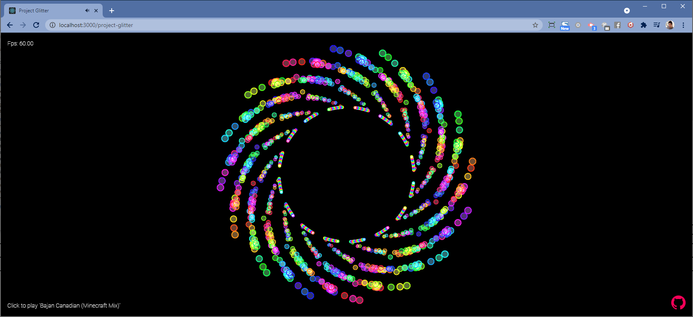
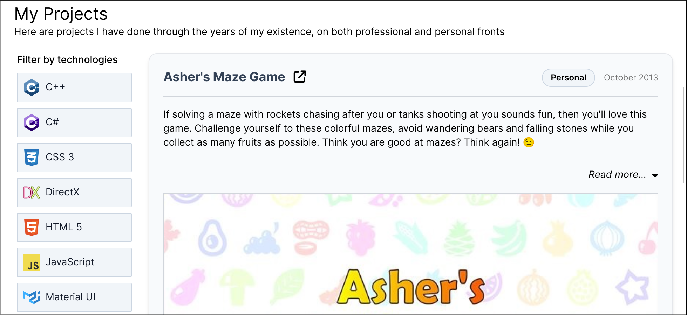

## My Public Projects

### Project Glitter

Something that I cooked up in a _learning week_ at work. Just some music visualizer made with AssemblyScript, WebAssembly and WebGL.

-   [Live demo](https://benglin.github.io/project-glitter/)
-   [Source code](https://github.com/Benglin/project-glitter)

### My Resume

Since I have to refresh the ancient Word document, I might as well come up with a live version that can be progressively updated :)

-   [My online resume](https://benglin.github.io/project-glitter/)
